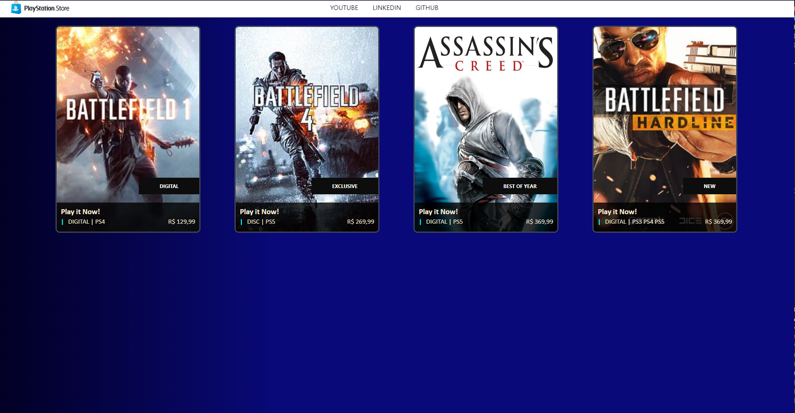

# PSN Store Clone



# Índice

* [Título e Imagens Home](#)
* [tecnologias utilizadas](#tecnologias-utilizadas)
* [Descrição do projeto](#descrição-do-projeto)
* [Status do Projeto](#status-do-projeto)
* [Acesso ao Projeto](#acesso-ao-projeto)

# Tecnologias utilizadas


# Descrição do Projeto

O projeto "PSN Store Clone" é projeto do BootCamp Santander Bootcamp 2023 - Fullstack Java+Angular da [Dio](https://web.dio.me/home). Nesse projeto, os alunos têm a oportunidade de aplicar seus conhecimentos no FrameWork Angular

# Status do Projeto

> 💹 Alpha 💹

# Acesso ao projeto

Para acessar e executar este projeto, siga os passos abaixo:

1. Certifique-se de ter o Node.js e o npm instalados em sua máquina.

2. Clone o Projeto

```bash
git clone  PSN
```

3. Entre no projeto

```bash
cd https://github.com/EversonDias/Angular-PSN-Store-Clone.git PSN
```

4. Instale as Dependências

```bash
npm install
```

5. inicie o projeto

```bash
npm start
```
